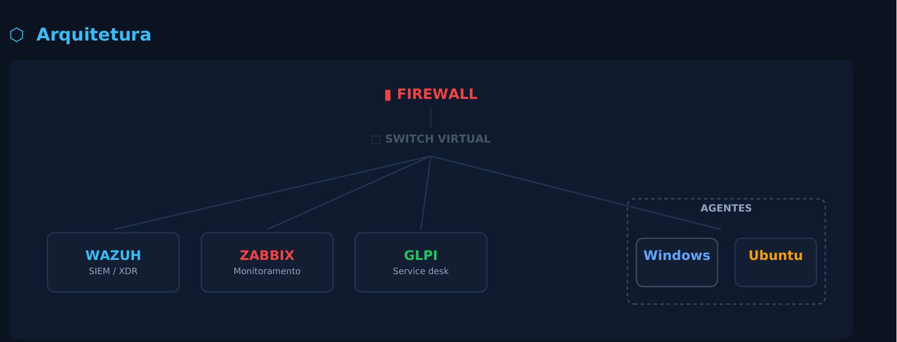
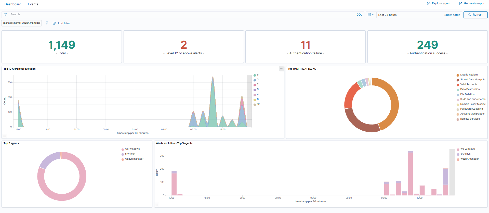
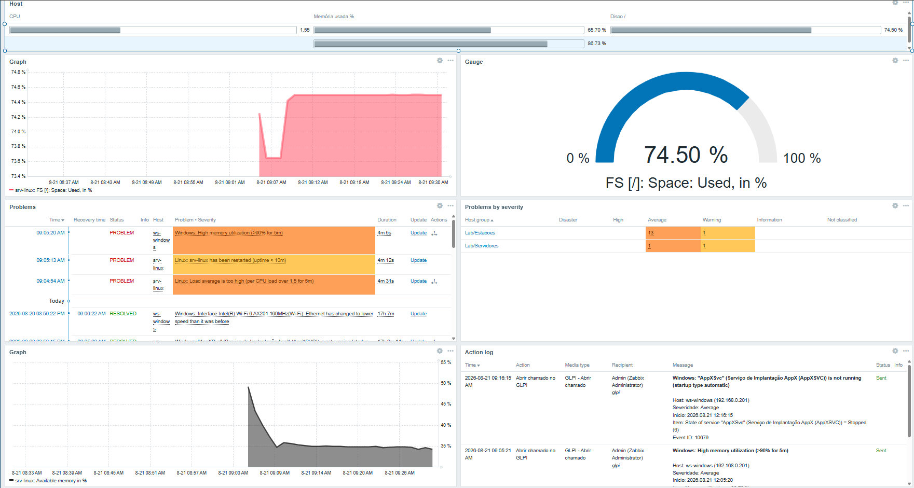
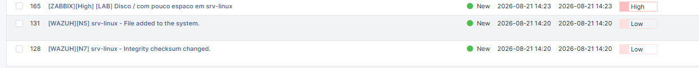

# Lab de SOC — Wazuh + Zabbix + GLPI

Laboratório de operações de segurança que integra três ferramentas de código aberto em um fluxo único: **detecção → resposta → registro**. Um alerta de segurança ou de infraestrutura pode se transformar automaticamente em um chamado classificado no service desk.

O laboratório roda inteiramente em uma VM com **5 GB de RAM**, utilizando ferramentas sem custo de licenciamento.



---

## 🎯 A ideia

A maioria dos labs de SIEM para em:

> "Instalei o Wazuh, olha o dashboard."

Este projeto vai além da detecção e busca fechar o ciclo operacional de um incidente:

- 🛡️ **Wazuh** detecta eventos, correlaciona alertas e executa resposta ativa, incluindo bloqueio de IP no firewall.
- 📊 **Zabbix** monitora disponibilidade e capacidade da infraestrutura.
- 🎫 **GLPI** recebe eventos de segurança e infraestrutura como chamados, com categoria e urgência definidas na origem.
- 👨‍💻 **Operador** analisa, resolve o incidente e registra a ação preventiva.


## 🧱 Stack

| Ferramenta | Versão | Papel |
|---|---:|---|
| **Wazuh** | 4.14.7 | SIEM / XDR — detecção, FIM e resposta ativa |
| **Zabbix** | 7.0 LTS | Monitoramento de disponibilidade e capacidade |
| **GLPI** | 10.0.26 | Service desk e gestão dos chamados |
| **Docker** | — | Containerização dos serviços |
| **Ubuntu Server** | 24.04 | Base do laboratório |


## 🔄 Fluxo de integração

### Wazuh → GLPI

O módulo `integrator` do Wazuh executa um script Python quando um alerta satisfaz os filtros definidos por `rule_id`.

```text
Evento
   ↓
Wazuh
   ↓
Regra de detecção/correlação
   ↓
Filtro por rule_id
   ↓
Script Python
   ↓
API REST do GLPI
   ↓
Chamado classificado
   ↓
Análise do operador
   ↓
Resolução + ação preventiva
```

O filtro utiliza regras específicas — incluindo a regra de correlação de força bruta — para evitar a criação de um chamado para cada evento individual.

### Zabbix → GLPI

O Zabbix utiliza um **Media Type do tipo Webhook**, escrito em JavaScript nativo e executado pelo próprio servidor Zabbix.

```text
Trigger
   ↓
Evento de infraestrutura
   ↓
Media Type / Webhook
   ↓
API REST do GLPI
   ↓
Chamado
   ↓
Atendimento
```

As credenciais são armazenadas em **macros protegidas**, sem necessidade de instalar componentes adicionais dentro do container.

---

## 🛡️ Resposta ativa

Um dos cenários validados no laboratório é um ataque de **força bruta SSH**.

O Wazuh identifica a sequência de tentativas, aplica a regra de correlação e executa uma ação de resposta ativa para bloquear a origem no firewall.

```text
Tentativas de login
        ↓
      Wazuh
        ↓
Correlação de eventos
        ↓
 Regra de segurança
        ↓
Resposta ativa
        ↓
Bloqueio do IP
        ↓
Chamado no GLPI
```

O objetivo é demonstrar que o SIEM não está apenas **observando** o ataque, mas também participando da **resposta**.

---

## 🧪 Cenário de força bruta SSH

Foi criada uma regra de correlação própria em:

```text
wazuh/local_rules.xml
```

A regra identifica múltiplas tentativas de autenticação relacionadas ao mesmo endereço de origem e eleva o evento para um nível de severidade apropriado.

O incidente também foi relacionado ao framework **MITRE ATT&CK**, permitindo contextualizar a técnica utilizada dentro de uma matriz reconhecida de ameaças.

---

## 📊 Resultados

Durante a validação do laboratório:

| Métrica | Resultado |
|---|---:|
| Eventos processados | **1.149** |
| Incidentes destacados | **2** |
| Nível dos incidentes destacados | **12** |
| Bloqueio automático | **Sim** |
| Bloqueio durante o ataque | **Sim** |
| Mapeamento MITRE ATT&CK | **Sim** |
| Integração Wazuh → GLPI | **Sim** |
| Integração Zabbix → GLPI | **Sim** |

O resultado mais importante não é apenas a quantidade de eventos processados, mas a capacidade de transformar eventos relevantes em **incidentes tratáveis**.

---

## 📁 Estrutura do repositório

```text
lab-soc-wazuh-zabbix-glpi/
│
├── core/
│   └── arquivos de composição e configuração
│
├── zabbix/
│   └── configurações do monitoramento
│
├── wazuh/
│   ├── configurações do Wazuh
│   └── local_rules.xml
│       └── regra própria de correlação
│
├── integrations/
│   ├── wazuh-glpi/
│   │   └── script Python
│   └── zabbix-glpi/
│       └── webhook JavaScript
│
├── docs/
│   ├── relatorio-fase1.pdf
│   ├── relatorio-fase2.pdf
│   ├── relatorio-fase3.pdf
│   ├── relatorio-fase4.pdf
│   ├── relatorio-fase5.pdf
│   └── arquitetura.png
│
└── README.md
```

---

## 🔌 Integrações

### Wazuh → GLPI

- Integração utilizando o módulo `integrator`
- Script Python
- API REST
- Filtro por `rule_id`
- Criação automática de chamados
- Classificação por incidente
- Evita abertura de chamados para cada evento individual

### Zabbix → GLPI

- Media Type Webhook
- JavaScript nativo
- API REST
- Macros protegidas para credenciais
- Sem dependência de scripts externos no container

---

## 📸 Capturas de tela

### Wazuh



### Zabbix



### GLPI




---

## 📚 Cinco fases documentadas

| Fase | Tema | Relatório |
|---:|---|---|
| **1** | Host, GLPI e API REST | [`docs/relatorio-tecnico-fase1.pdf`](docs/relatorio-tecnico-fase1.pdf) |
| **2** | Zabbix, agentes e triggers | [`docs/relatorio-tecnico-fase2.pdf`](docs/relatorio-tecnico-fase2.pdf) |
| **3** | Wazuh, FIM e regra de correlação | [`docs/relatorio-tecnico-fase3.pdf`](docs/relatorio-tecnico-fase3.pdf) |
| **4** | Integração das três ferramentas | [`docs/relatorio-tecnico-fase4.pdf`](docs/relatorio-tecnico-fase4.pdf) |
| **5** | Dashboards e validação por simulação | [`docs/relatorio-tecnico-fase5.pdf`](docs/relatorio-tecnico-fase5.pdf) |

---

## 💡 Lições aprendidas

O principal desafio do projeto não foi simplesmente instalar as ferramentas.

O trabalho mais importante foi definir:

- o que realmente deve virar chamado;
- o que deve ser tratado como ruído;
- quais eventos precisam de resposta automática;
- como evitar a criação excessiva de chamados;
- como dimensionar os recursos da VM;
- como controlar o consumo de disco;
- como limitar o consumo de módulos;
- como lidar com permissões de execução;
- como integrar ferramentas diferentes através de APIs.

Um dos aprendizados mais importantes foi perceber que uma regra de segurança muito agressiva pode gerar uma **amplificação de chamados** quando dispara em massa.

Por isso, o laboratório também funciona como um exercício de **engenharia de detecção**, e não apenas de instalação de ferramentas.

---

## 🎯 Objetivos técnicos demonstrados

- [x] Linux / Ubuntu Server
- [x] Docker
- [x] Wazuh
- [x] SIEM
- [x] XDR
- [x] File Integrity Monitoring (FIM)
- [x] Regras de correlação
- [x] Active Response
- [x] MITRE ATT&CK
- [x] Zabbix
- [x] Triggers
- [x] GLPI
- [x] REST API
- [x] Python
- [x] JavaScript
- [x] Webhooks
- [x] Integração entre sistemas
- [x] Service Desk
- [x] Gestão de incidentes
- [x] Monitoramento de infraestrutura

---

## 🔐 Segurança das credenciais

As credenciais e tokens presentes em capturas de tela dos relatórios foram **regenerados após a documentação**.

Nenhuma credencial real deve ser armazenada diretamente no repositório.

---

## 👨‍💻 Sobre o projeto

Projeto de estudo desenvolvido por **Kauan Trinchetti**, com foco em **SOC, Blue Team, monitoramento, detecção e resposta a incidentes**.

O objetivo é reproduzir, em uma infraestrutura pequena e de baixo custo, um fluxo semelhante ao encontrado em ambientes corporativos:

```text
                    DETECÇÃO
                       │
                       ▼
             ┌──────────────────┐
             │      WAZUH       │
             │ SIEM / XDR / FIM │
             └────────┬─────────┘
                      │
                      ▼
                   RESPOSTA
                      │
                      ▼
             ┌──────────────────┐
             │     FIREWALL     │
             └────────┬─────────┘
                      │
                      ▼
                  REGISTRO
                      │
                      ▼
             ┌──────────────────┐
             │       GLPI       │
             │   SERVICE DESK   │
             └────────┬─────────┘
                      │
                      ▼
                   ANÁLISE
                      │
                      ▼
             ┌──────────────────┐
             │     OPERADOR     │
             │  RESOLVE / AGE   │
             └──────────────────┘

        ZABBIX ───────► GLPI
        MONITORAMENTO    INCIDENTE
```

---

⭐ Se este projeto foi útil, considere deixar uma estrela no repositório.

**GitHub:** [KauanTrinchetti/lab-soc-wazuh-zabbix-glpi](https://github.com/KauanTrinchetti/lab-soc-wazuh-zabbix-glpi)
